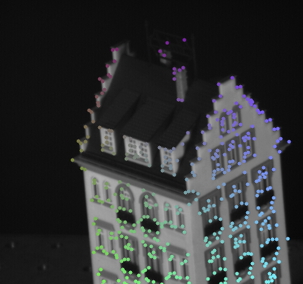
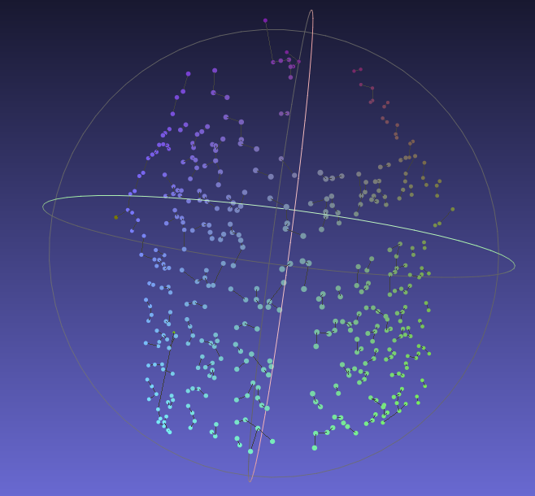

# Tomasi-Kanade-Reconstruction
Reconstruction of Hotel Structure via Tomasi-Kanade Factorization

Takes in a series of images and utilizes LK pyramid tracking to track features over time series.  Reconstructs image points by TK factorization into a Camera motion matrix M and Structure matrix S. For more info, check out the writeup here: [Writeup](https://github.com/ashdawngary/Tomasi-Kanade-Reconstruction/blob/master/CV_5369_SFM.pdf)

Color-coded feature map of hotel

Reconstructed structure(analogous coloring) of hotel given 40 frames of the sequence.
